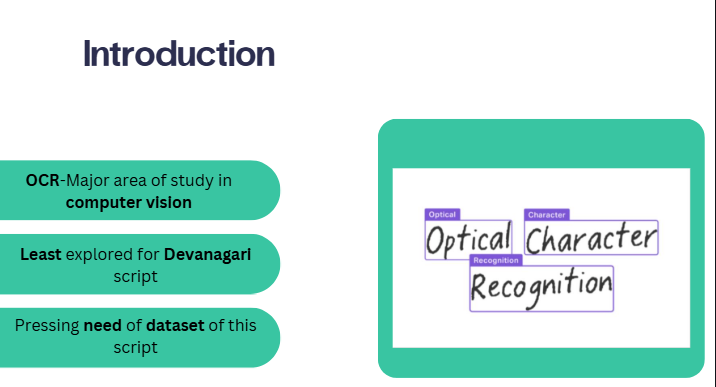
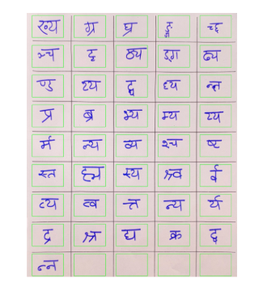
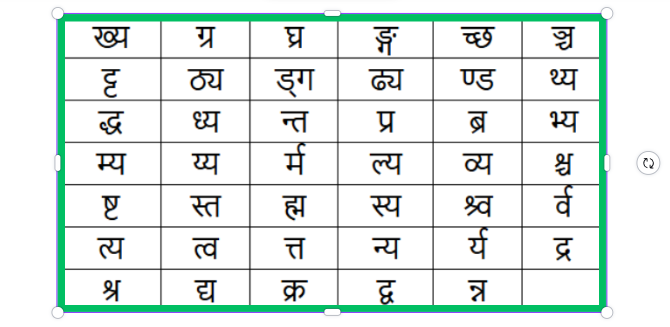
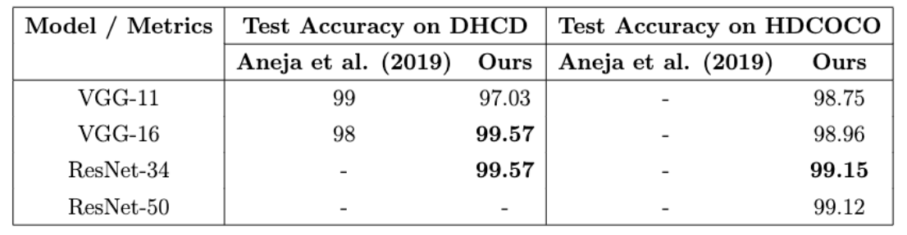

## **Handwritten Devanagari Character Recognition: Conjunct Consonants**

  

## **Project Objective**
Despite major advancements in Optical Character Recognition (OCR), recognizing complex Devanagari **conjunct consonants** remains a massive challenge. Most existing systems only focus on basic consonants, vowels, and numbers. 

The objective of this project is to fix this gap by creating a brand new, highly diverse dataset specifically for Devanagari conjunct consonants, and then training deep learning models to recognize them with high accuracy.

  
  
<i>Set of conjunct consonants we worked on</i>

## **What We Did**

* **Created the HDCOCO Dataset:** We built the *Handwritten Devanagari COnjunct COnsonants* (HDCOCO) dataset from scratch. It contains 50,020 images representing 41 distinct conjunct consonant characters.
* **Ensured Diversity:** To make the dataset robust, we collected handwriting samples from multiple schools and public exhibitions, capturing a wide variety of writing styles, ages, and demographics.
* **Data Preprocessing:** We cleaned the raw data using Otsu's algorithm to perfectly separate the ink from the background. The images were then standardized and resized while preserving fine strokes and diacritics.
* **Trained Deep Learning Models:** Instead of building from scratch, we used "transfer learning" on proven Convolutional Neural Network (CNN) architectures (like VGG and ResNet) to teach them how to read these complex characters.

  
  
<i>Sample images of the 41 Devanagari conjunct consonants from the HDCOCO dataset.</i>

## **Final Results**
The project successfully established new state-of-the-art benchmarks for Devanagari OCR. Out of all the models tested, the **ResNet-34** architecture performed the best, offering an incredible balance of high accuracy and fast processing time.

**Key Accuracy Metrics:**
* **99.57% accuracy** on the standard DHCD dataset.
* **99.15% accuracy** on our custom HDCOCO dataset.

By introducing this new dataset and proving the effectiveness of models like ResNet-34, this project lays a strong foundation for the future of document digitization and text recognition for Devanagari-based languages.

  
  
<i>Training and validation results for the ResNet-34 model.</i>

---
**Authors:** Sandhya Baral, Satyasa Khadka, Sudip Tiwari  
**Institution:** Department of Electronics & Computer Engineering, Pulchowk Campus, Institute of Engineering, TU
